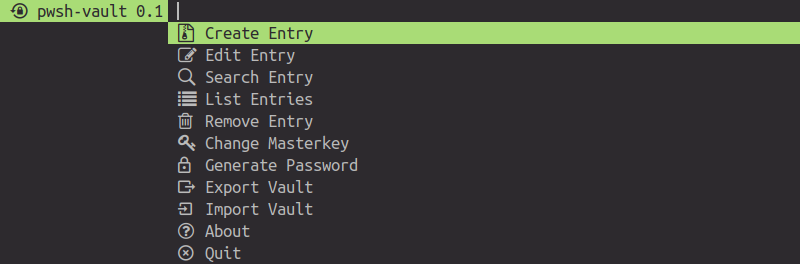
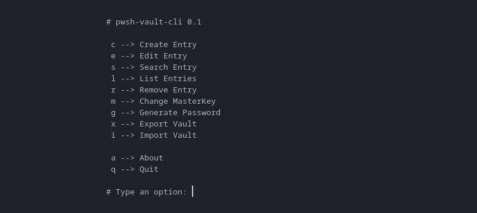
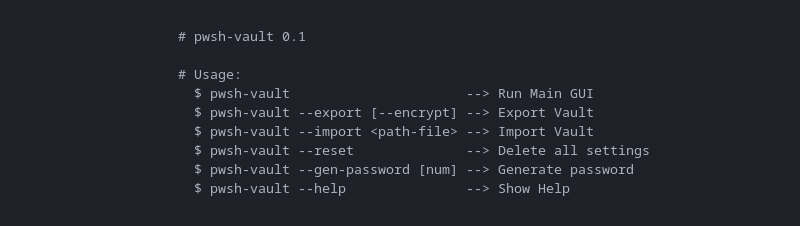

pwsh-vault - Basic Password Manager written in Bash+Dmenu
=========================================================

### Dependencies:
  
  * **Arch Linux:**
    * `sudo pacman -S gcc make coreutils sed expat zip unzip freetype2 libxinerama xterm brotli fontconfig libbsd libmd libpng libx11 libxau libxdmcp libxft libxrender` 

  * **Debian/Ubuntu:**
    * `sudo apt install gcc make coreutils sed zip unzip libexpat1-dev libfreetype-dev libxinerama-dev x11-utils xterm libxft-dev libfreetype6-dev libfontconfig1-dev libpng-dev libbrotli-dev libxrender-dev libmd-dev libxau-dev libbsd-dev libxdmcp-dev`

### Build and install:

* Open terminal and run the following commands:

  ```shell
  $ git clone https://github.com/q3aql/pwsh-vault.git
  $ cd pwsh-vault
  $ sudo make install clean
  ````

### GUI Version:

  ```shell
  pwsh-vault
  ```

 

 
### CLI Version:

  ```shell
  pwsh-vault-cli
  ```

 


  ```shell
  pwsh-vault (or pwsh-vault-cli) --help
  ```

 


### External links:

  * [dmenu homepage](https://tools.suckless.org/dmenu/)

