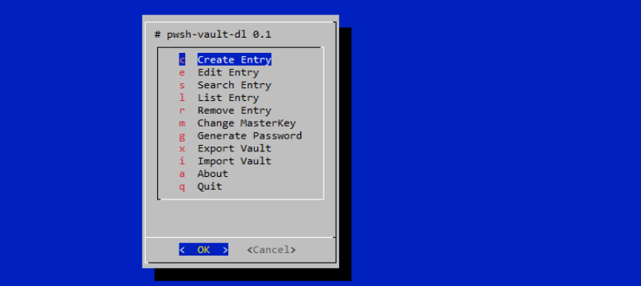

pwsh-vault - Basic Password Manager written in Bash+Dmenu
=========================================================

### Dependencies:
  
  * **Arch Linux:**
    
    ```shell
    $ sudo pacman -S git gcc make coreutils sed expat zip unzip dialog freetype2 libxinerama \
      brotli fontconfig libbsd libmd libpng libx11 libxau libxdmcp libxft libxrender
    ```` 

  * **Debian/Ubuntu:**
    
    ```shell
    $ sudo apt install git gcc make coreutils sed zip unzip dialog libexpat1-dev libfreetype-dev \
      libxinerama-dev x11-utils libxft-dev libfreetype6-dev libfontconfig1-dev libpng-dev libmd-dev \
      libbrotli-dev libxrender-dev libxau-dev libbsd-dev libxdmcp-dev
    ````

  * **Windows Cygwin ([apt-cyg](https://github.com/transcode-open/apt-cyg)):**
    
    ```shell
    $ apt-cyg install git make coreutils sed zip unzip dialog
    ````
    
  * **Android ([Termux](https://termux.com/)):**
    
    ```shell
    $ pkg install git make coreutils sed zip unzip dialog
    ````

### Build and install (Unix/Linux Posix):

* Open terminal and run the following commands:

  ```shell
  $ git clone https://github.com/q3aql/pwsh-vault.git
  $ cd pwsh-vault
  $ sudo make install clean
  ````

### Download & install (Windows Cygwin):

* Open terminal and run the following commands:

  ```shell
  $ git clone https://github.com/q3aql/pwsh-vault.git
  $ cd pwsh-vault
  $ make cygwin
  ````

### Download & install (Android Termux):

* Open terminal and run the following commands:

  ```shell
  $ git clone https://github.com/q3aql/pwsh-vault.git
  $ cd pwsh-vault
  $ make termux
  ````

### GUI Version (only for Linux):

  ```shell
  pwsh-vault
  ```

 


### NCURSES Version:

  ```shell
  pwsh-vault-dl
  ```

 

 
### CLI Version:

  ```shell
  pwsh-vault-cli
  ```

 


  ```shell
  pwsh-vault (or pwsh-vault-cli/dl) --help
  ```

 


### External links:

  * [dmenu homepage](https://tools.suckless.org/dmenu/)
  * [dialog homepage](https://invisible-island.net/dialog/dialog.html#download)
  * [apt-cyg](https://github.com/transcode-open/apt-cyg)
  * [Cygwin](https://www.cygwin.com/)
